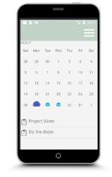

# BRAIN IT ON:

This project represents a to do application. The motivation of the app is to make doing tasks interactive for users by implementing achievements.
Video demo is availbale here: https://youtu.be/7ESWsYeYryM
0:02 - loading animation
0:10 - logout
0:13 - registration
0:29 - menu
0:32 - add task
0:49 - home page
0:52 - edit task
1:00 - calendar
1:08 - task list + make task done
1:54 - change level
2:06 - account page

**Among the features of this projects are:**

- Database integration using SQLite
- CRUD on tasks and users
- Level Achievement
- Animations
- Notifications
- Calendar events

**The App used such technologies as:**

- Android Studio as IDE;
- SQLite for working with database
- Java for developing the functionality;
- Nexus One API 24 as a virtual device
- Photoshop for designing the UI;
- Illustrator for drawing the icons and supplements;

## DEMO

After opening the app, user will see the intro page with a 5 second animation of spinning brain. The unanimated design is show below

During Intro activity, the backend checks whether there is any logged in user. If any is found, the next activity will be the First Page, which is the Home page for the user. Or if none are found, the user will see the Login Page, where they can either log in or register by clicking the “Sign Up button”.

Login Page:                         

On the register page, before putting new data into database, the password user entered will be hashed using MD5 to ensure the security of users.

When the user is already registered, they can login and receive a notification on the phone (Figure 4) mentioning their username and will be transferred to the first page in case of the password being correct.

Notification:

 

### Home Page

Home Page, introduced above, shows the first 3 tasks due soon, the level that user has, the progress bar with the level points and the picture with the brain, which will grow after every level achievement. 

User can swipe the task left to see two options: Edit and Done. 

### Task Page

Shows the details about the task with the due date highlighted in the caledar.

### Menu

The Menu Activity page has the CardView API, which allows the app to have these nice rounded rectangles, which act like a button to transfer user to the relevant Activity.

### My Account

This Activity displays the information about the logged in user.
 
The person’s icon fits the user’s gender. Upon registration, the user will mark his/her gender and this information will be written to the database. The gender user chose decides what icon to show: male or female.

### Calendar

In this activity users sees the calendar with the current date and the highlighted ones. The current date has a purple color and the days with the tasks are blue. For this Activity I used an API to highlight dates since in the regular CalendarView this option is absent. 

If user clicks on a highlighted date, the tasks due on that day will appear below the caledar view.

### Add task

User can add task by going to the relevant menu item. Also users is able to edit task and mark it done. Same CRUD options are available for account.

